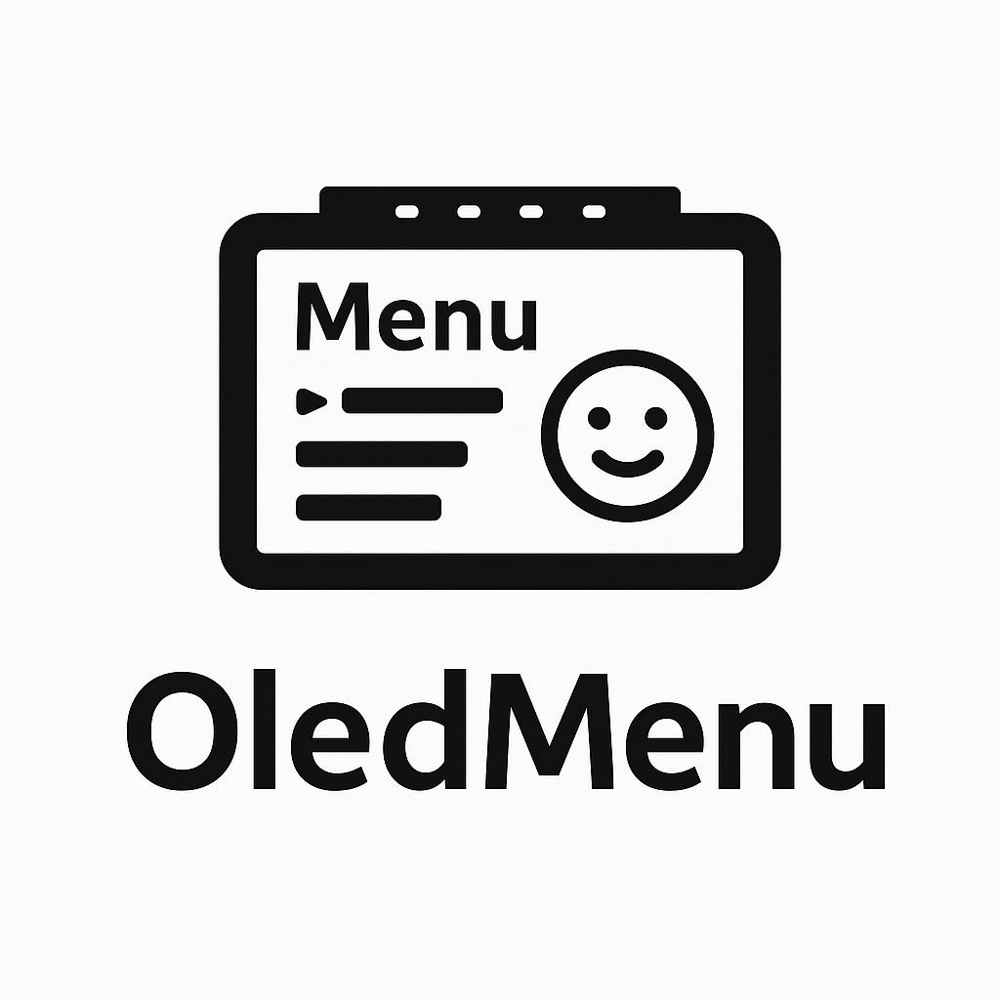

# 🖥️ OledMenu – Menüsystem für ESP32 mit OLED-Display



---

## 📘 Beschreibung

**OledMenu** ist ein modulares Menüsystem für den **ESP32**, entwickelt zur Steuerung eines **1.3" OLED-Displays (128x64, I2C, SH1106)**. Das Projekt bietet ein interaktives Hauptmenü mit Tasterbedienung, grafischer Anzeige und Messwertdarstellung in Echtzeit.

Ziel ist eine einfache Erweiterbarkeit, z. B. um eine Webkonfiguration (AsyncWebServer), SD-Kartenspeicherung oder zusätzliche Messfunktionen.

---

## 🧩 Funktionen

- 🏠 **Hauptmenü mit drei Punkten:**
  - Messwertanzeige (digitale Anzeige)
  - Graphanzeige (Mehrkanal-Graph)
  - Info-Seite mit Text
- 🔘 **Tastersteuerung (GPIO5):**
  - Kurzer Druck → Menüpunkt wechseln
  - Langer Druck → Menüpunkt aktivieren
- 📈 **Analogeingänge (bis zu 4 Kanäle):**
  - GPIO4, GPIO0, GPIO2, GPIO15
- 🧪 **Testmodus über Compiler-Flag (`TESTMODE`):**
  - Erzeugt Sinus-, Rechteck- und Dreiecksignale
- 🕓 **Delta-Zeitbasierte Signalberechnung** für stabile Frequenzen
- ⚙️ **Klassenstruktur:**
  - `OledMenu.h/.cpp` enthält das gesamte Menü- und Anzeigehandling
  - `main.cpp` bleibt minimal für Setup und Loop

---

## 📁 Projektstruktur

```
OledMenu/
│
├── src/
│   ├── main.cpp
│   ├── OledMenu.cpp
│   └── OledMenu.h
├── platformio.ini
└── docs/
    └── logo.png   ← (hier kann dein eigenes Logo hinzugefügt werden)
```

---

## ⚙️ Installation

1. Klone das Repository:
2. Öffne das Projekt in **VS Code** mit **PlatformIO**.
3. Verbinde deinen **ESP32** via USB.
4. Passe bei Bedarf `platformio.ini` an (I2C-Pins, Testmodus etc.).
5. Kompiliere und lade das Projekt hoch.

---

## 🧠 Verwendung

- Beim Start zeigt das OLED kurz ein Copyright mit Smile-Logo.
- Danach erscheint das Hauptmenü.
- Navigiere mit dem Taster:
  - **Kurz drücken** → Nächster Menüpunkt
  - **Lang drücken** → Auswahl bestätigen
- In den Modi *Messwert* oder *Graph* kannst du mit einem Druck zurück ins Menü wechseln.

---

---


## 📜 Lizenz

Dieses Projekt steht unter der **MIT-Lizenz**. Weitere Informationen findest du in der Datei `LICENSE`.

---

## 💡 Autor

**Werner Fischer** – 2025  
